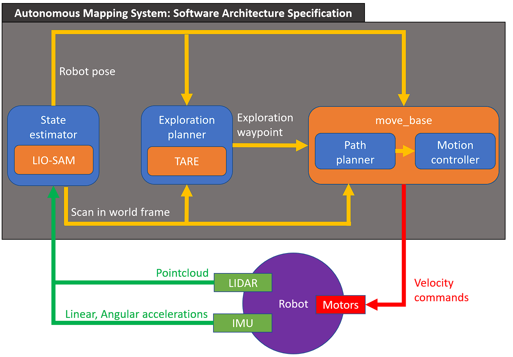

# Autonomous Mapping System (AMS)

<div id="top"></div>

<!-- PROJECT LOGO -->
<br />
<div>
  <p>
    Autonomous Mapping Software System that uses an unmanned ground vehicle (robot) equipped 
    with LIDAR, IMU, wheel encoders and motors to autonomously explore unknown static and dynamic environments.
    The resulting output of the system is a 3D map containing the registered obstacles and surfaces of the environment.
    <br/>
    <br/>
    <a href="https://github.com/TThibeau/Autonomous-Mapping-System/blob/main/README.md"><strong>Explore the docs »</strong></a>
    <br/>
    <br/>

[//]: # (    <a href="https://github.com/TThibeau/???">View Demo</a>)

  </p>
</div>

<!-- TABLE OF CONTENTS -->
<details>
  <summary>Table of Contents</summary>
  <ol>
    <li>
      <a href="#about-the-project">About The Project</a>
      <ul>
        <li><a href="#built-with">Built With</a></li>
      </ul>
    </li>
    <li>
      <a href="#getting-started">Getting Started</a>
      <ul>
        <li><a href="#prerequisites">Prerequisites</a></li>
      </ul>
    </li>
    <li><a href="#contact">Contact</a></li>
  </ol>
</details>

## About The Project

Repository for the Autonomous Mapping System resulting from the master thesis
"Design And Implementation Of An Autonomous Mapping System For Indoor Environments Using LIDAR And ROS".

Software architecture:



<p >(<a href="#top">back to top</a>)</p>

### Built With

* [catkin](https://wiki.ros.org/catkin)

<p>(<a href="#top">back to top</a>)</p>

### Packages from other authors included/adapted in workspace

#### Robot and LIDAR platform

* [turtlebot3_description](https://wiki.ros.org/turtlebot3_description)
* [velodyne_description](https://github.com/lmark1/velodyne_simulator/tree/master/velodyne_description)
* [velodye_gazebo_plugins](https://github.com/lmark1/velodyne_simulator/tree/master/velodyne_gazebo_plugins)

#### Simulation worlds

* [aws_robomaker_small_house_world](https://github.com/aws-robotics/aws-robomaker-small-house-world)
* [dynamic_logistics_warehouse](https://github.com/belal-ibrahim/dynamic_logistics_warehouse)
* [aws-robomaker-hospital-world](https://github.com/aws-robotics/aws-robomaker-hospital-world)

#### Modules

* [lio_sam](https://github.com/TixiaoShan/LIO-SAM)
* [tare_planner](https://github.com/caochao39/tare_planner)
* [navigation (move_base)](https://github.com/ros-planning/navigation)

#### TARE support/interface packages

* [*sensor_scan_generation](https://github.com/HongbiaoZ/autonomous_exploration_development_environment/tree/noetic/src/sensor_scan_generation)
* [*terrain_analysis](https://github.com/HongbiaoZ/autonomous_exploration_development_environment/tree/noetic/src/terrain_analysis)
* [*terrain_analysis_ext](https://github.com/HongbiaoZ/autonomous_exploration_development_environment/tree/noetic/src/terrain_analysis_ext)
* [*loam_interface](https://github.com/HongbiaoZ/autonomous_exploration_development_environment/tree/noetic/src/loam_interface)

#### Tools

* [*visualization_tools](https://github.com/HongbiaoZ/autonomous_exploration_development_environment/tree/noetic/src/visualization_tools)
* [*waypoint_rviz_plugin](https://github.com/HongbiaoZ/autonomous_exploration_development_environment/tree/noetic/src/waypoint_rviz_plugin)
* [point_cloud_converter](http://wiki.ros.org/point_cloud_converter)

#### Other dependencies

* [geometry2 (tf2_sensor_msgs)](https://github.com/ros/geometry2/tree/noetic-devel/tf2_sensor_msgs)

*Packages originally part of
the [autonomous_exploration_development_environment](https://github.com/HongbiaoZ/autonomous_exploration_development_environment)
repository. Some were slightly adapted for the specific needs of this project.

### Custom packages created for this project

* point_to_pose: Converts a PointStamped message topic to a PoseStamped message topic.
* obstacle_distance_measurement: Measurement tool to determine the distance of the robot to the obstacles based on LIDAR
  readings.
* state_estimation_logger: Measurement tool for determining the accuracy/error of the state estimation.
* init_tf_publisher: Publishes the initial transforms needed for the various modules.
* odometry_offset_fixer: Publishes the pointcloud with removed z-axis offset due to state estimation error.
* body_corrected_publisher: Publishes the body_corrected frame corresponding to the state estimation with its z-axis
  error removed.
* ams_configuration:
    * launch files to run the exploration missions/tests
    * robot urdf and gazebo files
    * adapted world files
    * rviz configuration

## Getting Started

### Prerequisites

Install ROS Noetic: [ROS Noetic installation wiki](https://wiki.ros.org/noetic/Installation/Ubuntu)

### Clone and build this workspace

  ```sh
  git clone ???
  cd ~/ams_ws
  source devel/setup.sh
  catkin_make
  ```

### Run an exploration mission

  ```sh
  cd ~/ams_ws
  source devel/setup.sh
  roslaunch ams_configuration integration_test_fixed.launch 
  ```

After opening gazebo and loading all models, press the arrow button (on bottom-left in gazebo window) to start the
simulation.

## Contact

Project Link: [https://github.com/TThibeau/Autonomous-Mapping-System](https://github.com/TThibeau/Autonomous-Mapping-System)

<p>(<a href="#top">back to top</a>)</p>